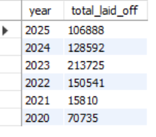
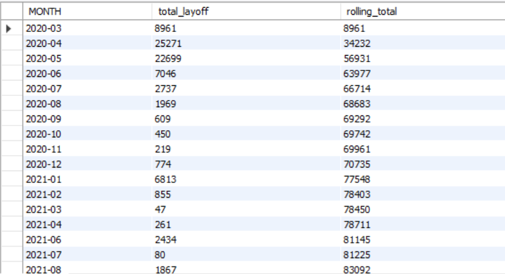
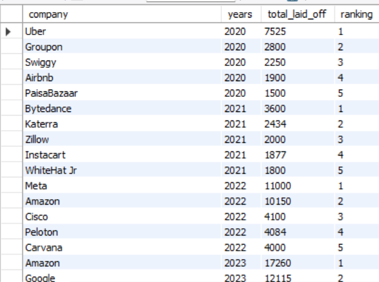
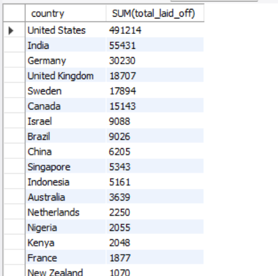
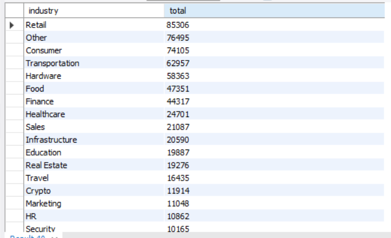
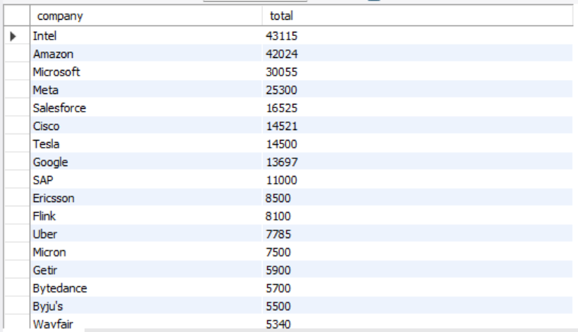

📊 SQL Company Layoff EDA

 📌 Overview
Exploratory Data Analysis (EDA) performed on a global layoff dataset containing 43,264 records using MySQL.

The objective was to clean raw data, remove duplicates, standardize fields, and extract workforce trend insights across industries, countries, and time.

---

🛠 Tools & Techniques
- MySQL
- CTEs
- Window Functions (ROW_NUMBER, DENSE_RANK)
- Aggregations
- Date Functions
- Data Cleaning & Standardization

---

📈 Key Analysis & Results

🔹 Year-wise Layoffs

🔹 Rolling Total Trend

🔹 Top 5 Companies Per Year

🔹 Country-wise Layoffs

🔹 Industry-wise Layoffs

🔹 Top Companies Overall

---
💡 Key Insights

- 2023 recorded the highest total layoffs across the dataset.
- Certain industries consistently ranked higher in workforce reductions.
- Layoff spikes show clear year-over-year trend shifts.
- A small number of companies accounted for a large percentage of total layoffs.

---

📂 Dataset

Public workforce layoff dataset (43,264 records).

